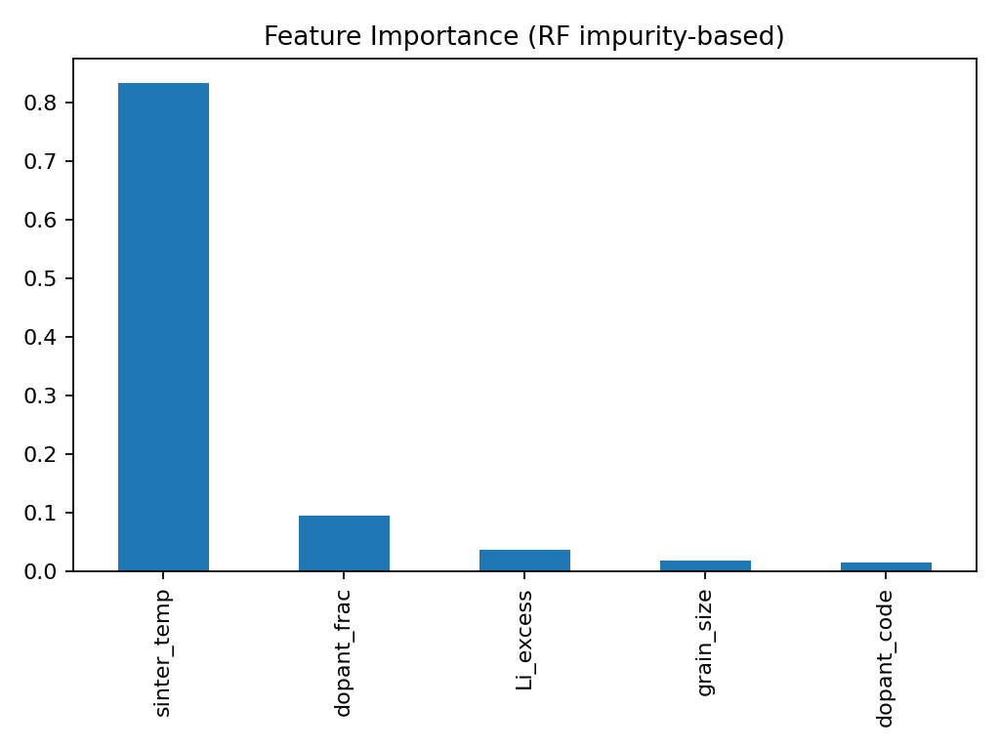
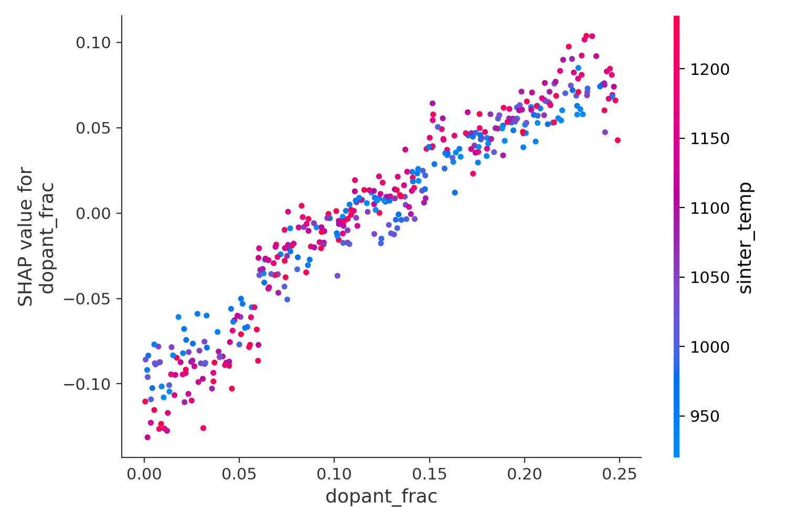

# LLZO-SHAP: Interpretable ML Analysis of Dopant Effects 
  on Li-ion Conductivity in LLZO Solid Electrolytes

 # Motivation

 Decompose the effects of sintering temperature, doping, 
 and Li excess on ionic conductivity σ(ion) in solid-state electrolyte LLZO into interpretable components using MI and SHAP.

 
 # Results
  .

  

  
  

  
   How to run
  
  -python data_synth_LLZO.py

  -python importance.py
  
  -python shap_LLZO.py

