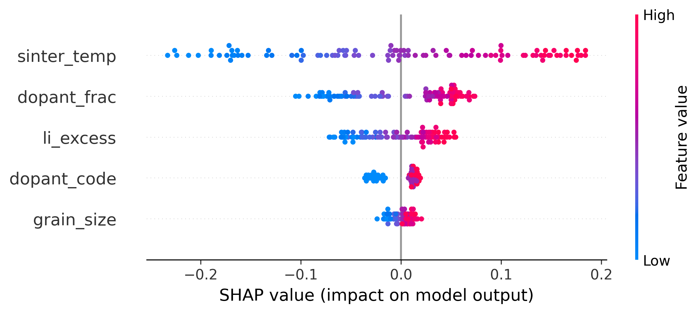

  #LLZO Ionic Conductivity (Synthetic) — SHAP Analysis#

  

  Target: Ionic conductivity trend sigma(ion) in LLZO (synthetic).
  Insight: Sintering temperature dominates sigma(ion), followed by dopant fraction
  and Li excess with clear non-linear effects; dopant type and grain size are secondary.

  

  Dopant fraction was selected for further analysis due to its strong non-linear
  contribution observed in the global SHAP summary.

  
  Dependence: The effect of dopant fraction on sigma(ion) is non-linear and modulated
  by sintering temperature, indicating coupled processing-composition effects.
  

  
   How to run
  
  -python beeswarm.py
  
  -python shap_LLZO.py

