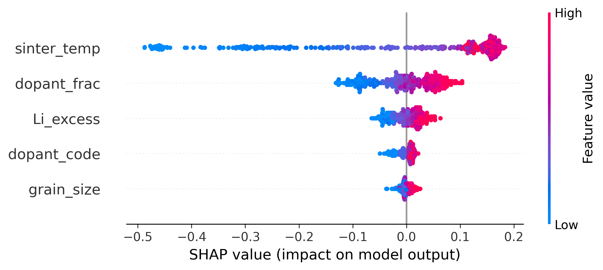
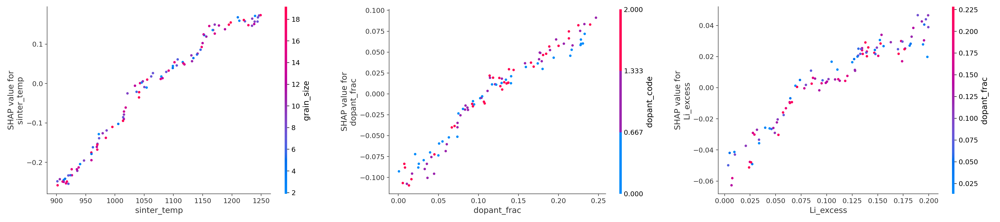

# LLZO-SHAP: Interpretable ML Analysis of Dopant Effects 
  on Li-ion Conductivity in LLZO Solid Electrolytes

 # Motivation

 Decompose the effects of sintering temperature, doping, 
 and Li excess on ionic conductivity σ(ion) in solid-state electrolyte LLZO into interpretable components using MI and SHAP.

 
 # Results

  

Sintering temperature has the widest spread, 
meaning it drives most of the variance in σ(ion); 
high values (red) consistently push conductivity up,
 low values (blue) push it down. 
Dopant fraction and Li excess follow the same monotonic pattern 
with smaller magnitude. Dopant type (categorical) and grain size contribute only marginally.

How to read: Each plot isolates one feature. 
The x-axis is the feature value, the y-axis is its SHAP 
contribution to σ(ion). The color shows a second feature, 
so vertical spread at a given x reveals interaction effects.

  
  

Dependence Plots (Top-3 Features)

sinter_temp × grain_size — Monotonic, near-linear increase across 900–1250 °C. 
The color (grain size) is well-mixed vertically, 
indicating that the temperature effect is largely independent of grain size
 in this range — consistent with densification being the dominant mechanism.
dopant_frac × dopant_code — Strong positive contribution up to ~0.20. 
Mild vertical spread by dopant type suggests a weak coupling between 
dopant identity and optimal fraction, rather than a dominant single dopant.
Li_excess × dopant_frac — Near-linear positive contribution that begins to plateau around 0.15, 
plausibly reflecting saturation of Li-site compensation once volatilization losses are offset.

  Summary: The pipeline recovers three physically meaningful trends from synthetic LLZO data — (1) sintering-driven densification as the primary conductivity lever, (2) a saturating benefit from dopant substitution, and (3) Li excess acting as an independent compositional compensation. This confirms that the RF + SHAP framework captures the expected structure–processing–property relationships, making it suitable for transfer to experimental datasets.

  
   How to run
  
  -python data_synth_LLZO.py

  -python importance.py
  
  -python shap_LLZO.py

